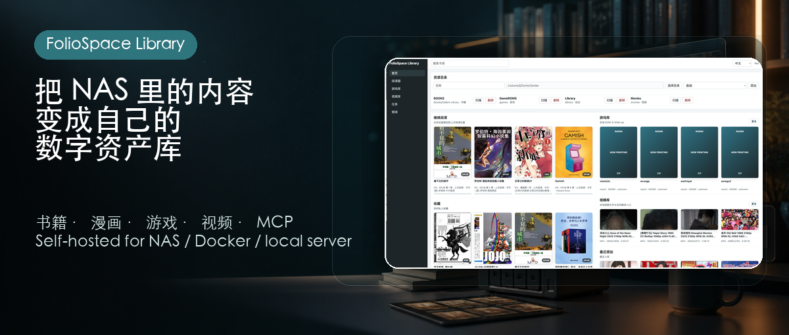
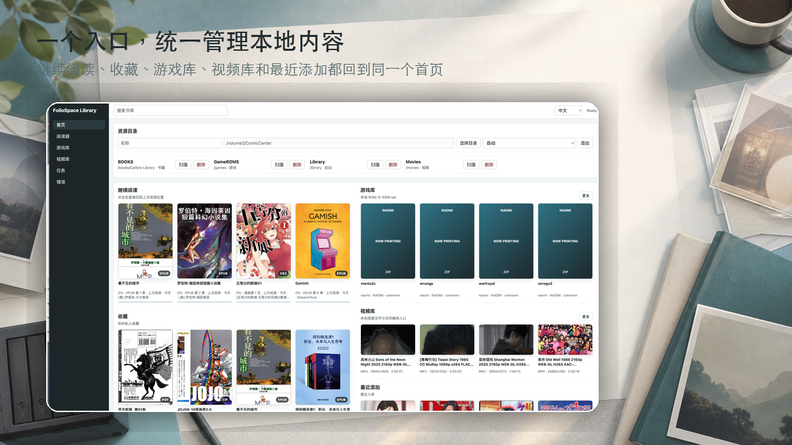
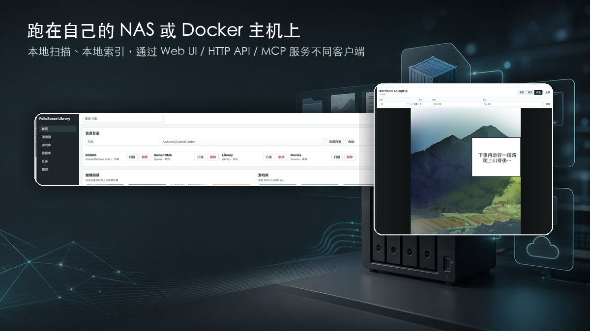
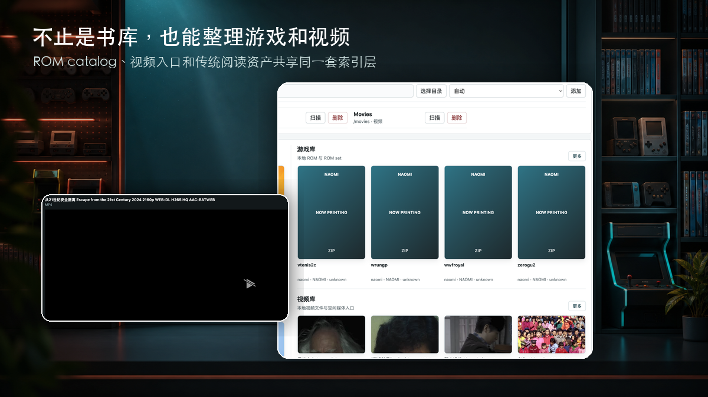

# FolioSpace Library

[Website](https://foliospace.app/) · [Docker Hub](https://hub.docker.com/r/funland/foliospace-library) · [Client API](docs/api/client-v1.md) · [MCP](docs/mcp/usage.md)



FolioSpace Library is a personal digital asset library that runs on a NAS, Docker host, or local server. It provides a unified indexing layer and stable client service layer for Apple-device experiences across reading, games, spatial media, documents, photos, videos, and related audio collections.

It is not trying to become a complete Plex, Jellyfin, or Immich replacement. The first priority is personal asset indexing: scanning, identifying, covers/thumbnails, classification, search, favorites, recent access, progress, and private state. Dedicated clients such as a reader app, GameEMU, and Vision Pro experiences own the actual consumption UI.

The current implementation still starts from the FolioSpace Reader codebase and keeps the existing reading MVP operational while the model evolves toward `Asset` / `LibraryItem`.

Current release branch: `0.881`.

## Screenshots








## License

Copyright (C) 2026 funland co.,Ltd.

The server and web application source in this repository is released under the GNU Affero General Public License v3.0. See [`LICENSE`](LICENSE).

FolioSpace Library indexes user-owned local files only. It does not distribute books, comics, ROMs, movies, or other media content.

## Runtime Layout

- `/config`: SQLite database, generated covers/thumbnails, runtime cache.
- `/library`: read-only mounted asset library root.
- `/books`, `/games`: optional read-only roots used by the default Docker compose example.
- `8080`: web UI and HTTP API.

Recommended NAS config root:

```text
/volume1/docker/foliospace-library
```

## Local Development

The backend requires Go 1.22 or newer. The frontend requires Node.js 20 or newer.

```bash
npm --prefix web install
npm --prefix web run build
go test ./...
go run ./cmd/foliospace-reader
```

## Environment

```bash
FOLIOSPACE_CONFIG_DIR=/config
FOLIOSPACE_LIBRARY_DIR=/library
FOLIOSPACE_DIRECTORY_ROOTS=/library,/books,/games
FOLIOSPACE_ADDR=:8080
FOLIOSPACE_API_TOKEN=
FOLIOSPACE_SCAN_WORKERS=2
```

Set `FOLIOSPACE_API_TOKEN` to require API authentication from environment variables. If it is empty, release `0.881` can create the first access token from the web setup page and stores only a SHA-256 token hash in SQLite. Native clients can send `Authorization: Bearer <token>`. The web UI stays publicly loadable, then prompts for the access token and receives an HttpOnly cookie so covers, pages, and EPUB iframe resources can load through normal browser requests.

Authentication helpers:

- `GET /api/auth/status`: returns whether token auth is enabled.
- `POST /api/auth/check`: accepts `{"token":"..."}` and returns `{"ok":true}` for a valid token.
- `POST /api/auth/logout`: clears the web auth cookie.

First-run setup helpers:

- `GET /api/setup/status`: returns whether the service has an access token and at least one library.
- `POST /api/setup/initialize`: creates the first access token and first library.
- `GET /api/config/directory-roots`: returns container-visible root directories for the setup picker.

## Client API v1

Detailed client integration docs are in [`docs/api/client-v1.md`](docs/api/client-v1.md).

- `GET /api/client/info`: service metadata, supported formats, and capability flags.
- `GET /api/client/home`: `continueReading`, `recentBooks`, and `collections` in one response.
- `GET /api/client/books/:id/manifest`: a client-safe open manifest. CBZ/ZIP books include page URLs; EPUB books include spine, TOC, `resourceBaseUrl`, `coverUrl`, and progress; PDF books expose an opaque Range-capable stream URL for single-page or double-page client layouts.
- `GET /api/client/games/:id/manifest`: a client-safe game launch manifest with platform, checksums, emulator hint, and an opaque file URL.
- `GET/PUT /api/client/books/:id/private-state`: client-safe private status, favorite, rating, tags, and note sync.
- `GET/PUT /api/client/preferences`: client UI language and reader preference sync.
- `GET/PUT /api/settings/scan`: scan worker settings for NAS devices with different CPU and memory budgets.
- `GET /api/client/search`, `/api/client/books/favorites`, and `/api/client/books/private-status/:status`: private-state-aware discovery shelves.

Client API book and collection responses omit local NAS file paths.

## MCP

Agent integration docs are in [`docs/mcp/usage.md`](docs/mcp/usage.md). The MCP server wraps the stable Client API for diagnostics, library lookup, manifests, favorites/private-status shelves, preferences, private reader state, progress, scan jobs, scan worker settings, job control, and collection access. Heavy media streams still use the HTTP URLs returned by the API.

End users can install the MCP binary on the machine where their agent client runs:

```bash
curl -fsSL https://foliospace.app/install-mcp.sh | sh
```

Release maintainers can build macOS/Linux MCP packages with:

```bash
VERSION=0.881 ./scripts/build-mcp-release.sh
```

## Product Direction

Detailed product direction and the proposed `Asset` / `LibraryItem` model are in [`docs/product/foliospace-library-direction.md`](docs/product/foliospace-library-direction.md).

Core asset types:

- Books and EPUBs.
- Comics and CBZ/ZIP archives.
- Game ROMs and ROM sets.
- PDFs, manuals, art books, guides, and reference documents.
- Photos, videos, Vision Pro spatial photos, and spatial videos.
- OSTs and audio material connected to games, books, and collections.

ROM support is for indexing and launching user-owned local content. FolioSpace Library does not distribute ROMs, provide download sources, or bundle pirated assets.

## Docker

Release `0.881` image tag:

```bash
docker pull funland/foliospace-library:0.881
```

For local verification:

```bash
mkdir -p data/config data/library data/books data/games
docker compose up --build
```

For a NAS deployment, mount your real libraries as read-only:

```bash
docker run -p 8080:8080 \
  -v /volume1/docker/foliospace-library/config:/config \
  -v /volume2/ComicCenter:/library:ro \
  -v /volume2/Books:/books:ro \
  -v /volume2/GameROMS:/games:ro \
  -e FOLIOSPACE_DIRECTORY_ROOTS=/library,/books,/games \
  funland/foliospace-library:0.881
```

Open `http://localhost:8080`. On a fresh `/config`, the setup page asks for an access key and lets you choose a container path such as `/library`, `/books`, or `/games`. If a directory is missing from the setup page, add a Docker volume mapping first; FolioSpace Library can only browse paths visible inside the container.

## Current MVP Support

- P0 reading formats: `.cbz`, `.zip`, `.epub`.
- P0 game formats: `.nes`, `.sfc`, `.smc`, `.gba`, `.gb`, `.gbc`, `.nds`, `.3ds`, `.cia`, `.chd`, `.iso`, `.bin`, `.cue`; `.zip` and `.7z` are treated as ROM sets only when the library type is `game`.
- Series derivation: immediate parent directory, with root-level files grouped under `Unsorted`.
- Reading: backend streams one ZIP image entry or EPUB resource at a time.
- Games: backend indexes local ROM metadata and checksums, exposes client-safe launch manifests without NAS paths, and lazily caches supported Libretro boxart under `/config/cache/game-covers`.
- Errors: empty files, archive open failures, walk errors, and unsupported future categories are recorded as structured rows.

Near-term expansion priority:

1. Keep existing EPUB/comic reader APIs stable.
2. Add game asset indexing for local ROMs and ROM sets.
3. Add spatial photo / spatial video indexing.
4. Move data model language from Book/Series toward Asset/LibraryItem after the first non-reading asset type is real.
